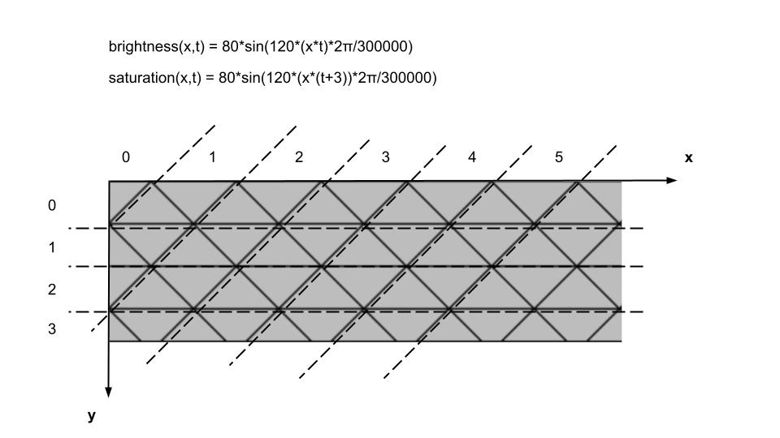
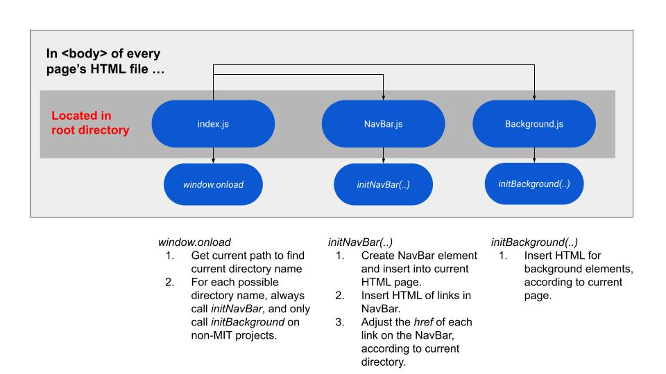
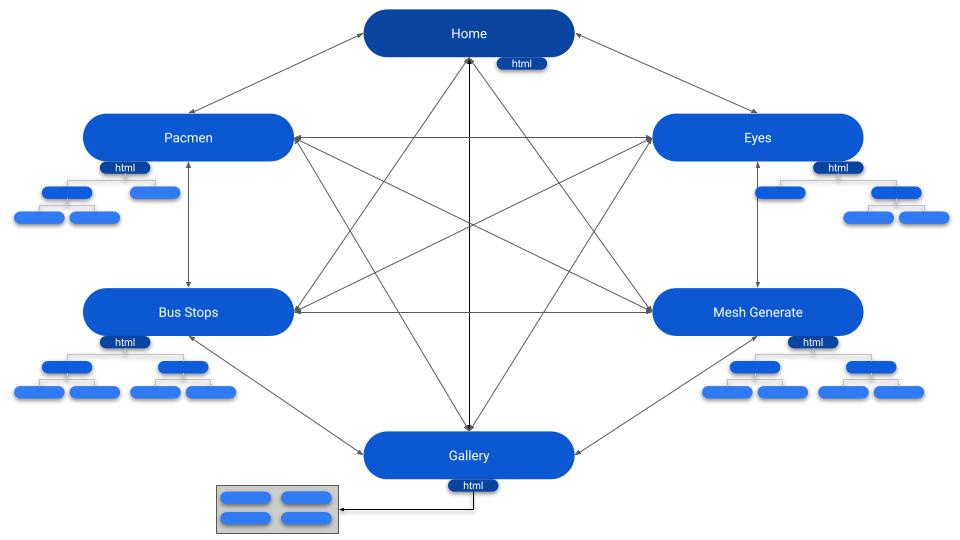

# Portfolio Project 2021

## Design Composition
This project was constructed using 'vanilla' Javascript and HTML elements, with the exceptions of Bootstrap's Card and Accordion components on the Home page. Bootstrap Icons were used whenever necessary. 

  
## Structure

### Navigation Header
The grid of triangles at the top of the screen is a single canvas element. Canvas elements are much more efficient than SVG elements at rendering many objects, so it was suitable to use a canvas element. Each triangle has a corresponding Triangle object, which holds data such as its location, brightness, and saturation. The mapping of the axes for this grid was a bit improvised. Triangles sharing the same row have the same y-value, while triangles that are diagonal from each other share the same x-value. The triangles use HSL functional notation, which make it possible to describe a color as a function of its hue, brightness and saturation. As a function of time, wave functions were used to change each triangle's brightness and saturation according to its location in the grid.

### Navigation Bar
The navigation bar of this portfolio project is an in-line SVG. It's visible height is 50px, but it's actual height is 200px. This gives a designated 150px for the MIT Projects dropdown and the search results dropdown. The animation for hovering over a link was created after experimenting extensively with SVG Animate elements.

The navigation bar is designed to be present on every webpage and be able to display the correct content for a given webpage. To accomplish this, the NavBar.js script is located in the top-level directory of the application alongside the index.js script, which contains the _window.onload_ function. The _window.onload_ function in index.js is the one-and-only function called when any webpage is loaded in the application. 

  
When traversing from one webpage to another, the navigation bar is reconstructed and the path for each navigation-link changes relative to where the new webpage resides in the application. As a result, any webpage can be traversed to from another webpage. 

### Search Bar
The search bar was added much later in the design phase and is an HTML input element embedded within an SVG. SVG's namespace designates external types of elements to its ForeignObject element. In this way, it can still function as an HTML input element. For every new input in the search field, the function _processSearchBar()_ is called. This function utilizes a string operation known as [Levenshtein Distance](https://en.wikipedia.org/wiki/Levenshtein_distance), which measures the difference, or distance, between two sequences of characters. To account for spelling errors, this algorithm was implemented to add a sort of "fuzzy logic" to the process instead of simply checking if a term was an exact match of another. Every possible subject within this portfolio project was given a list of keywords, and each keyword in these lists would be passed through the _levenshteinDist(..)_ function along with the current input. The lesser the distance between words, the more closer they were to matching. Initially, this didn't always work properly so additional checks had to be added to this.

